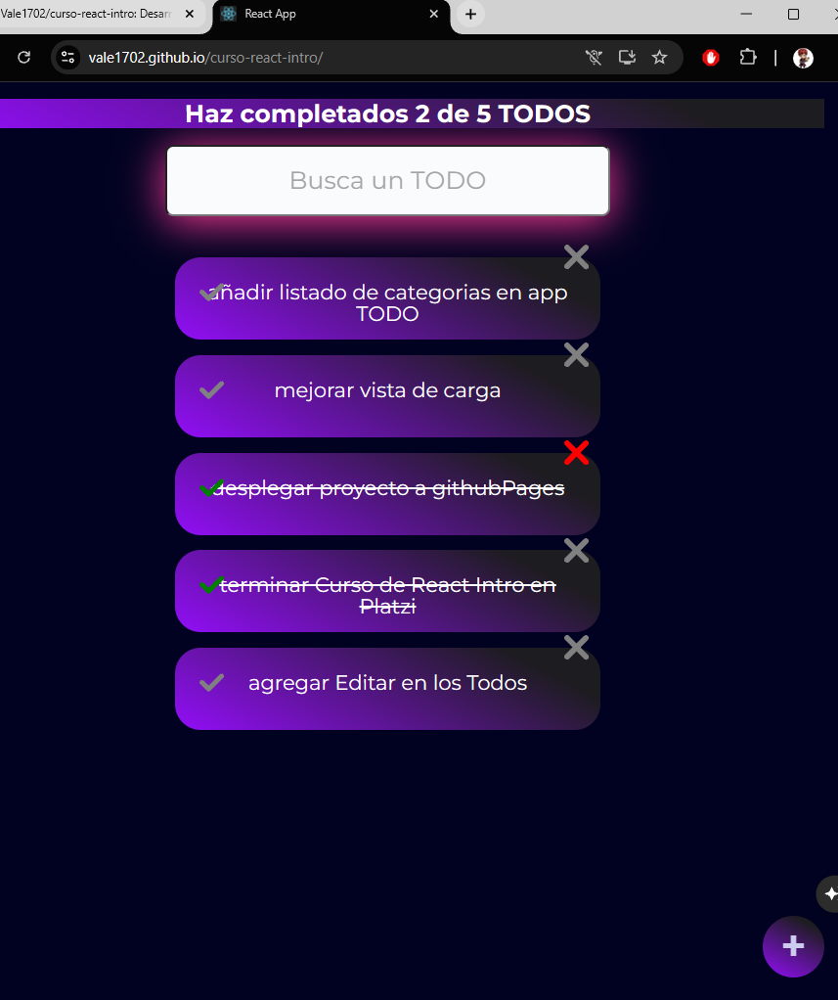

# 📝 Todo App

Aplicación web desarrollada con React para gestionar tareas de manera sencilla, rápida e interactiva.

🔗 **Demo:** https://vale1702.github.io/curso-react-intro/  
💻 **Repositorio:** https://github.com/Vale1702/curso-react-intro

---

## 🌟 Funcionalidades

- ➕ Agregar nuevas tareas
- ✅ Marcar tareas como completadas
- ❌ Eliminar tareas
- ⚛️ Manejo de estado con React Hooks
- 🎯 Interfaz simple e intuitiva

---

## 🛠️ Tecnologías

- React
- JavaScript
- CSS
- GitHub Pages (deploy)

---

## 📸 Vista previa



---

## 🚀 Cómo ejecutar el proyecto

```bash
git clone https://github.com/Vale1702/curso-react-intro.git
cd curso-react-intro
npm install
npm start
```
--

## 💡 Aprendizajes

En este proyecto trabajé en:

- Uso de React y Hooks (`useState`)
- Manejo de estado en aplicaciones
- Componentización
- Interacción con el usuario (eventos)


## 🔧 Próximas mejoras

- 💾 Persistencia de tareas con localStorage
- 🎨 Mejora de diseño (UI)
- 📱 Versión responsive